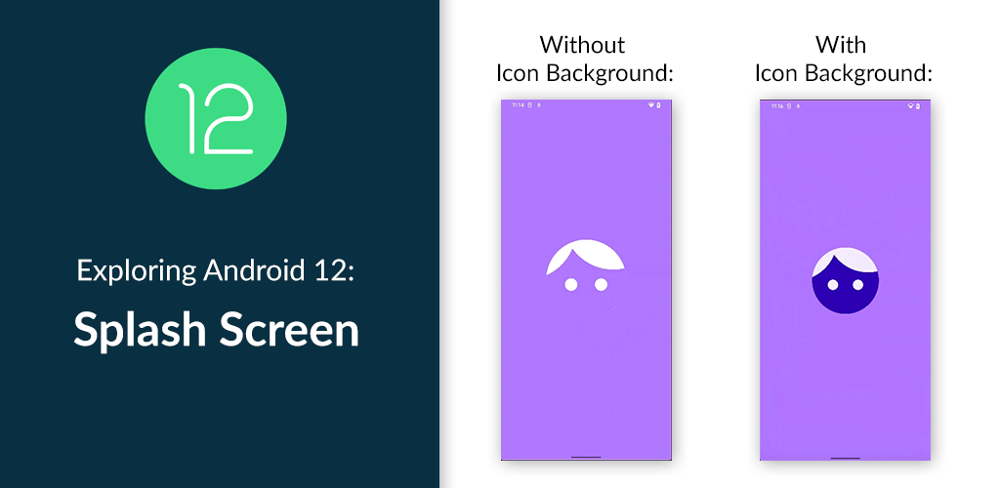
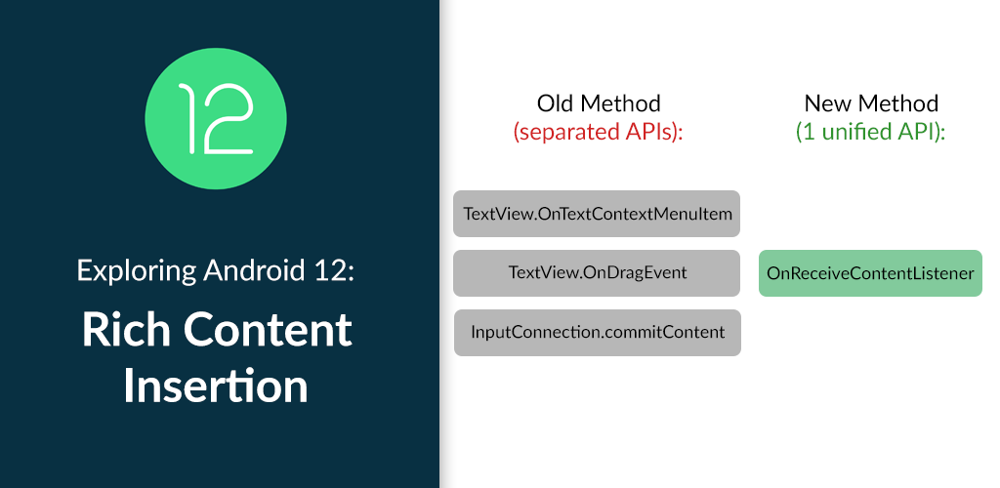
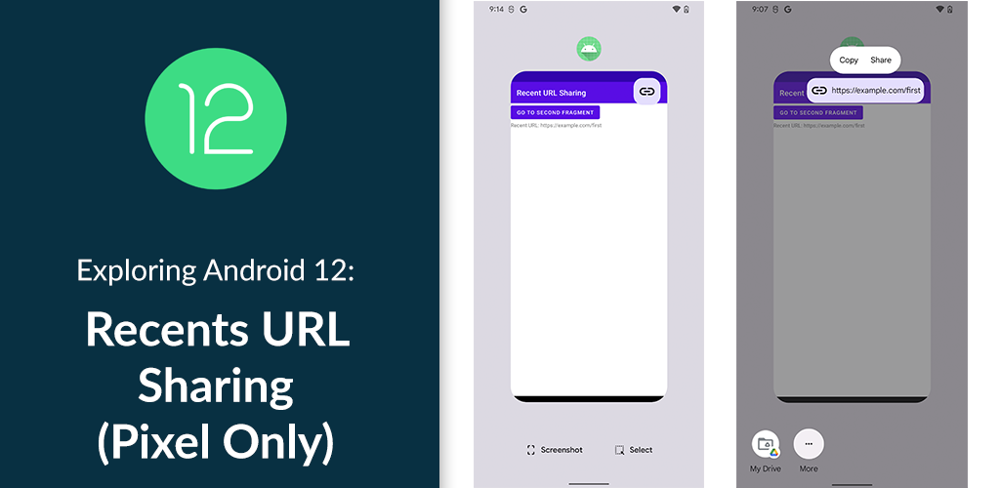

# android-12-samples

Sample projects for Android 12.

## Table of Content

| | |
| :-: | :-: |
| Splash Screen ([Github](/splash-screen)) ([Tutorial](https://yggr.medium.com/exploring-android-12-splash-screen-21f88cc8e8f8)) | Rounded Corner API ([Github](/rounded-corners)) ([Tutorial](https://yggr.medium.com/exploring-android-12-rounded-corner-api-a09ae1e8c528)) |
|  |  |
| Rich Content Insertion ([Github](/rich-content-insertion)) ([Tutorial](https://yggr.medium.com/exploring-android-12-rich-content-insertion-328348e3a842)) | Recents URL Sharing (Pixel Only) ([Github](/recent-url-sharing)) ([Tutorial](https://yggr.medium.com/exploring-android-12-recents-url-sharing-pixel-only-5865899caef2)) |
|  |  |
| VibratorManager & New Vibration Primitives ([Github](/actuator-effects)) ([Tutorial](https://yggr.medium.com/exploring-android-12-vibratormanager-new-vibration-primitives-e862c95fe938)) | Data Access Rationale ([Github](/data-access-rationale)) ([Tutorial](https://yggr.medium.com/exploring-android-12-data-access-rationale-f0e713e87f96)) |
|  |  |
| Blurs, Color Filters, & Other Effects ([Github](/render-effect)) | |
|  | |
